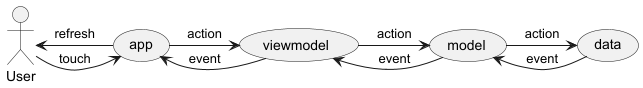

# Motus

Simple version of Motus game for Android.
Aim of the game is to guess the word of 6, 7 or 8 letters in 7 tries.
At each tries, the game will tell you how many letters are at the right place and how many are in the word but not at the right place.

## Architecture

The game is composed of several module :
- `app` : containing the UI 
- `viewmodel` : containing the game view models
- `model` : containing the main model
- `data` : containing the data source

Their interaction can be schematized as follow :

